# Bitcoin Sentiment × Hyperliquid Trader Performance Analysis

> Exploring the relationship between the Bitcoin Fear & Greed Index and trader performance on Hyperliquid across 211,224 trades from 32 accounts (Jan 2023 – Dec 2025).

---

## Repository Structure

```
trading-sentiment-analysis/
├── data/                        # Place raw datasets here (not committed)
├── src/
│   ├── 01_data_preprocessing.py
│   ├── 02_eda.py
│   ├── 03_sentiment_analysis.py
│   └── 04_advanced_insights.py
├── assets/                      # All generated charts
├── requirements.txt
└── README.md
```

## Setup & Run

```bash
pip install -r requirements.txt

# Add datasets to data/ folder, then run in order:
python src/01_data_preprocessing.py
python src/02_eda.py
python src/03_sentiment_analysis.py
python src/04_advanced_insights.py
```

---

## Dataset Overview

| Dataset | Rows | Period | Key Columns |
|---|---|---|---|
| Hyperliquid Trader Data | 211,224 | Jan 2023 – Dec 2025 | Account, Coin, Side, Direction, Closed PnL, Fee, Size USD |
| Fear & Greed Index | Daily | 2023–2025 | Date, Classification |

**32 unique trader accounts · 246 unique coins traded**

---

## Exploratory Data Analysis

### 1. Daily Trade Volume by Sentiment

Activity is heavily concentrated in the 2024–2025 period, with volume spikes reaching 2,000–6,000+ trades/day. Fear and Greed days co-exist even in high-volume periods, showing sentiment shifts mid-rally.

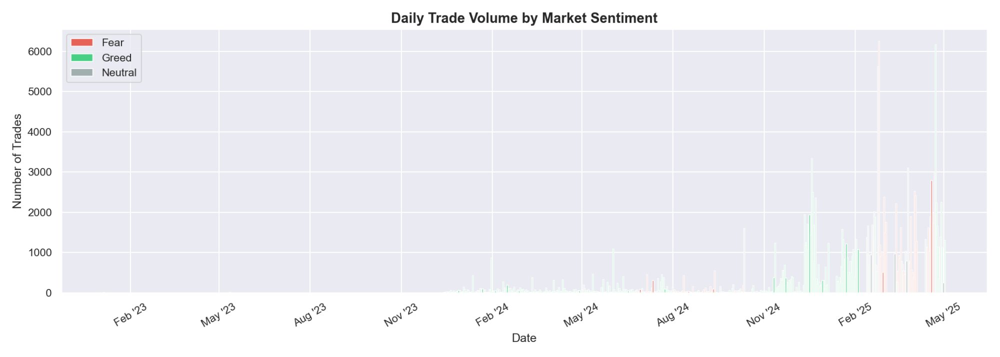

---

### 2. Closed PnL Distribution by Sentiment

All three regimes show a spike at zero (many open trades with unrealised PnL). For closed trades, Greed has the widest right tail — large winning trades are more frequent.

| Sentiment | n (closed trades) | Median PnL | Mean PnL |
|---|---|---|---|
| Fear | 24,041 | $5.0 | $88.4 |
| Neutral | 15,907 | $3.8 | $57.8 |
| Greed | 43,124 | $7.0 | $85.1 |

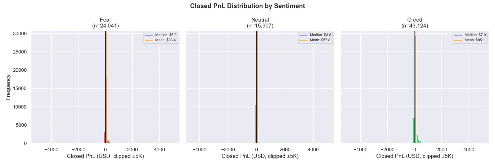

> **Insight:** Despite Fear showing a higher mean ($88.4) than Greed ($85.1), this is driven by a small number of outsized wins. The median tells a more honest story — Greed traders consistently pocket more per trade.

---

### 3. Trade Direction Mix by Sentiment

During **Greed**, short-opening surges to ~26% — traders are actively fading the rally. During **Fear**, long-opening dominates at ~31%, with shorts at ~24%. This is counter-intuitive and suggests these traders lean contrarian.

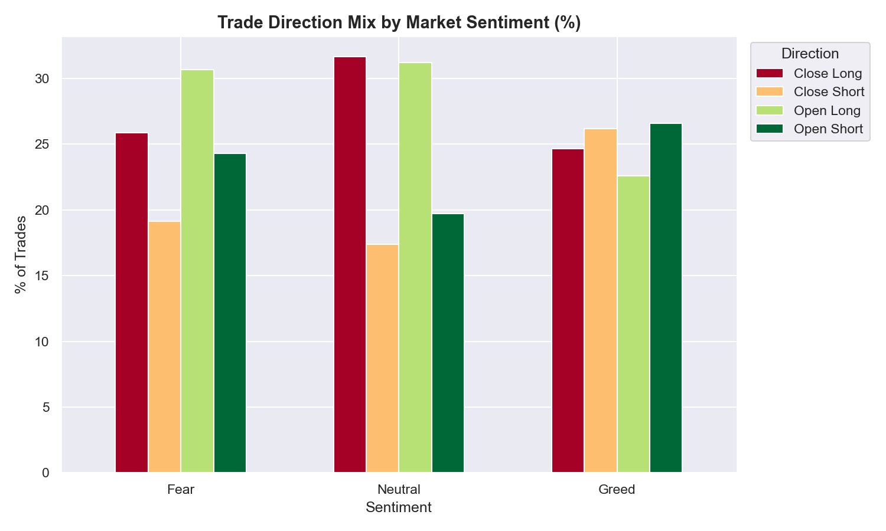

---

### 4. Sentiment Mix for Top 10 Coins

Meme coins (FARTCOIN, MELANIA, PURR/USDC, WLD, kPEPE) are traded **80–85% during Greed** — almost exclusively a bull market product. BTC and ETH are more balanced. HYPE is split nearly 50/50 Fear/Greed, reflecting active trading in all conditions.

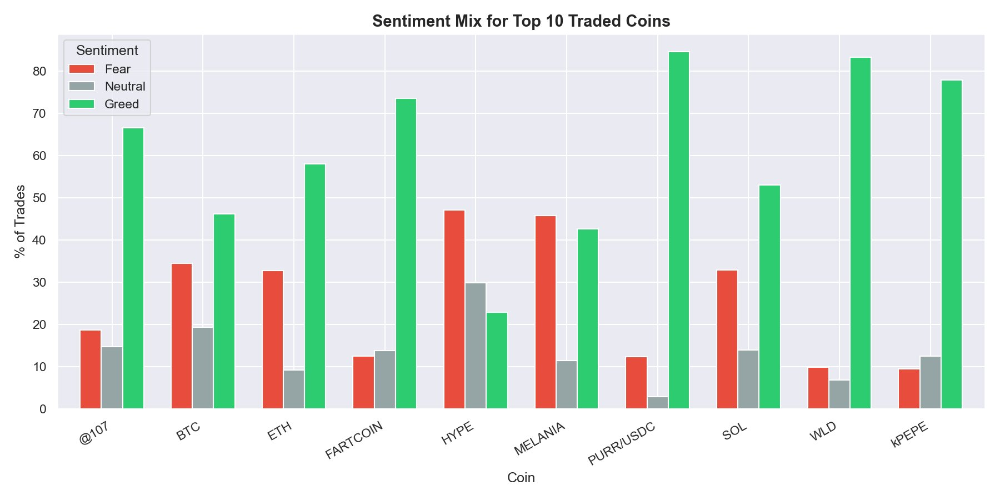

---

### 5. Average Trade Size by Sentiment

Counterintuitively, the largest average trade sizes occur during **Fear ($6,811)**, not Greed ($4,777). This suggests traders deploy bigger positions when they see dips as buying opportunities — a "buy the fear" behaviour.

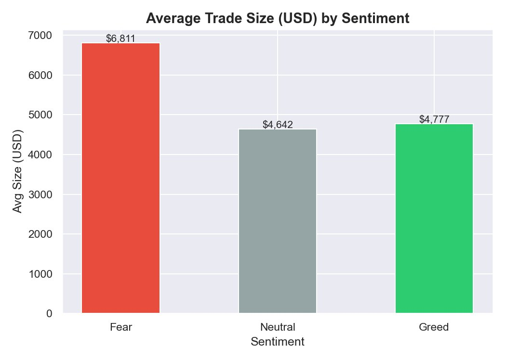

---

## Sentiment vs Trader Performance

### 6. Win Rate by Sentiment

All three regimes produce well above 50% win rates. Fear produces the second-highest win rate — traders are more selective (higher conviction) during Fear, which translates to a higher hit rate.

| Sentiment | Win Rate |
|---|---|
| Fear | **85.1%** |
| Neutral | 86.7% |
| Greed | 81.9% |

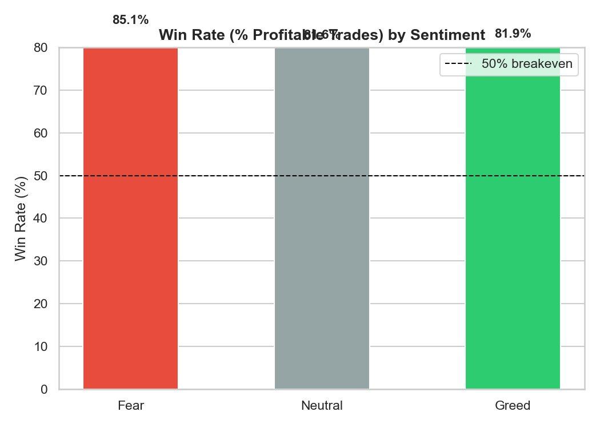

---

### 7. Cumulative PnL by Sentiment Phase

Greed phases accumulate the most absolute PnL (~$4.3M cumulative), while Fear phases reach ~$3M. The Greed curve is steeper and more consistent. Fear shows a strong early burst but plateaus mid-sequence — likely reflecting concentrated positions by a few smart accounts.

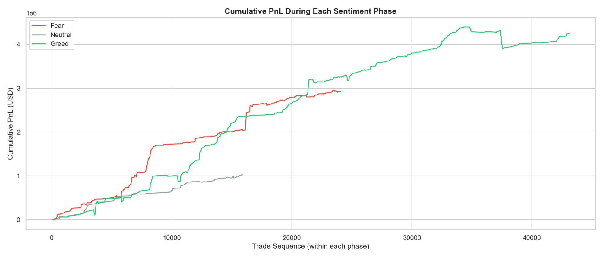

---

### 8. Long/Short Open Ratio by Sentiment

One of the most striking findings: traders are **net-long during Fear (1.26x)** and **net-short during Greed (0.85x)**. This is a contrarian positioning pattern — these 32 accounts are not retail momentum chasers.

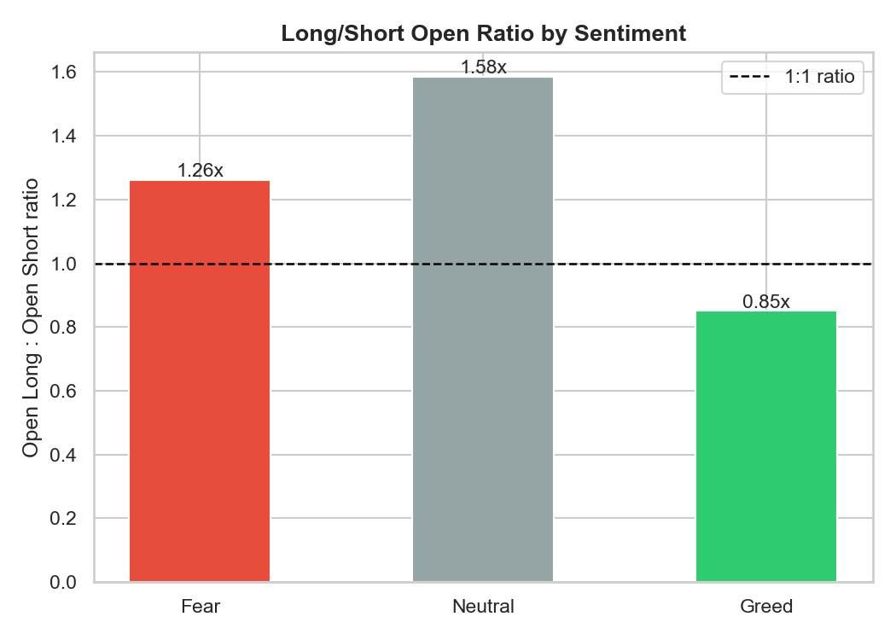

> **Insight:** The conventional wisdom ("buy greed, avoid fear") is **inverted** for this trader cohort. They open more longs in Fear and more shorts in Greed — and it works, given their 85%+ win rates.

---

### 9. PnL per Trade Distribution

The IQR for all three sentiments is clustered tightly around zero, but Greed shows a meaningfully higher upper quartile. The outlier tails are symmetric — large wins and losses exist in all regimes.

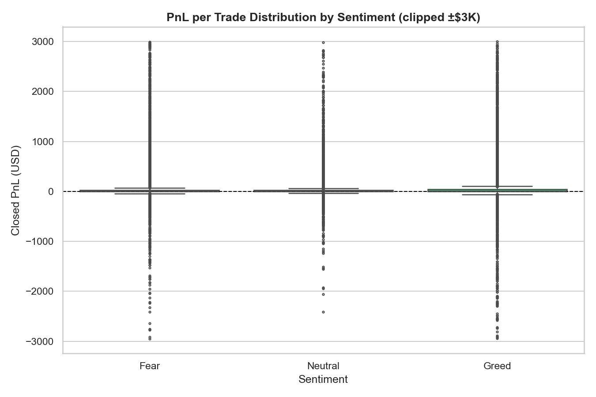

---

### 10. Avg PnL per Trade: Coin × Sentiment Heatmap

Key observations:
- **SOL** is the standout Fear trade: $1,008 avg PnL/trade in Fear vs $174 in Greed
- **ETH** performs best in Fear ($488) — classic "buy the dip" asset
- **TRUMP** loses heavily in Greed (−$748) — late Greed entries on political meme coins are destructive
- **ZRO** has extraordinary Neutral-phase PnL ($1,572) — likely event-driven
- **FARTCOIN** loses in Fear (−$10) but gains in Greed ($32) — meme coins need momentum

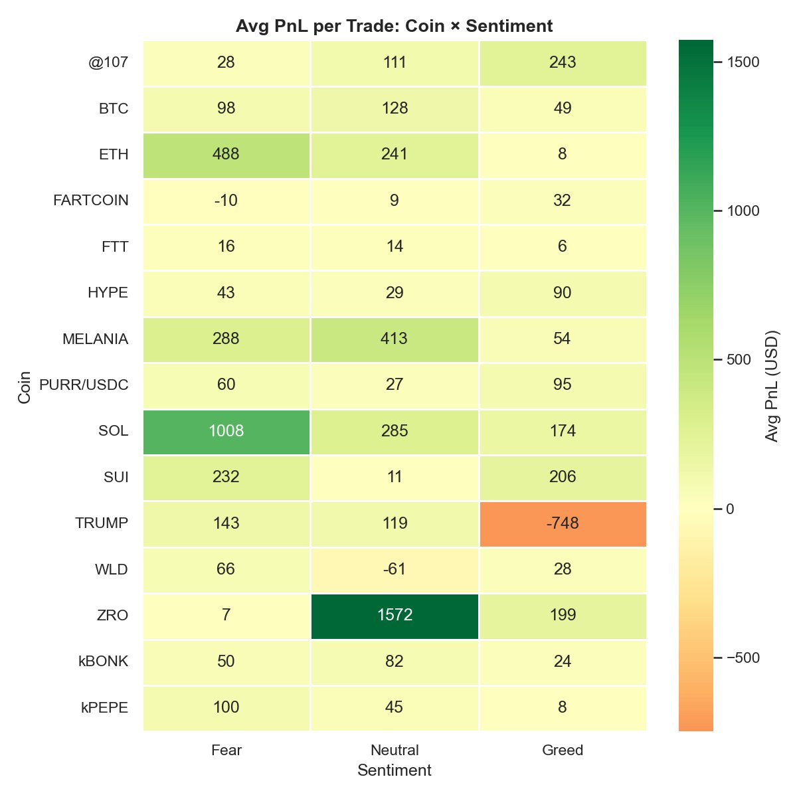

---

## Advanced Insights

### 11. Smart Money vs Rest of Traders

Accounts maintaining positive avg PnL across both Fear and Greed regimes are classified as "Smart Money." These accounts generated **$6,148,332** in total PnL vs **$2,051,998** for all other traders — capturing **75% of total ecosystem profits** despite being a minority of accounts.

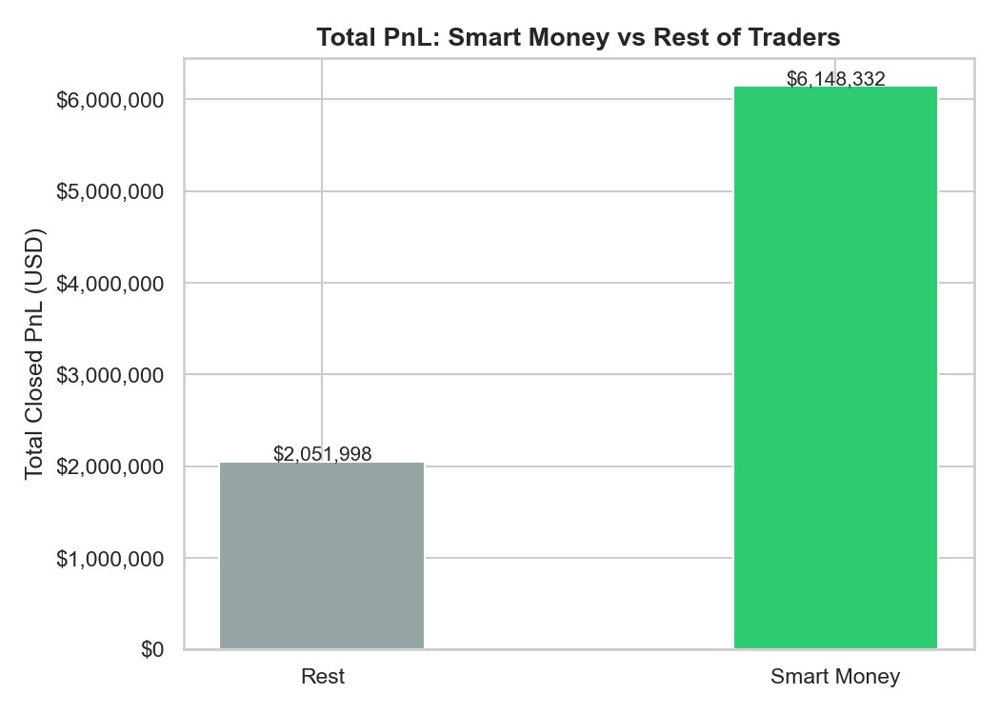

---

### 12. Monthly Avg PnL vs Sentiment Score Over Time

The orange line tracks monthly sentiment (0=Fear → 2=Greed), blue bars show avg PnL/trade. Key observations:
- **April 2024**: highest single-month avg PnL (~$205/trade) at peak Greed
- **Jul–Sep 2024**: sentiment collapsed to near-Fear; PnL fell to $25–$75/trade
- **Nov–Dec 2024**: Greed resurgence, PnL recovered to $120–$170/trade
- **Early 2025**: PnL stayed elevated even as sentiment dipped — smart money holding positions

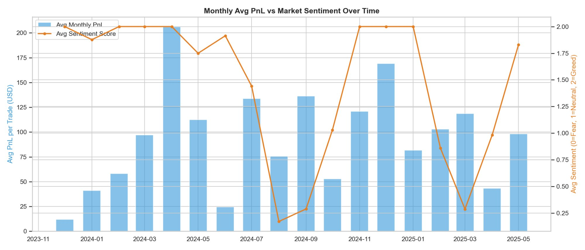

---

### 13. Contrarian Signal: Fear vs Greed Period Close PnL

Comparing Close Long trades executed during Fear vs Greed periods:
- Fear period closes: **Median $4**
- Greed period closes: **Median $10**

The simple contrarian thesis is weakly supported. Greed-period closes actually have a higher median — these traders time their exits well during euphoria rather than their entries during Fear generating outsized returns.

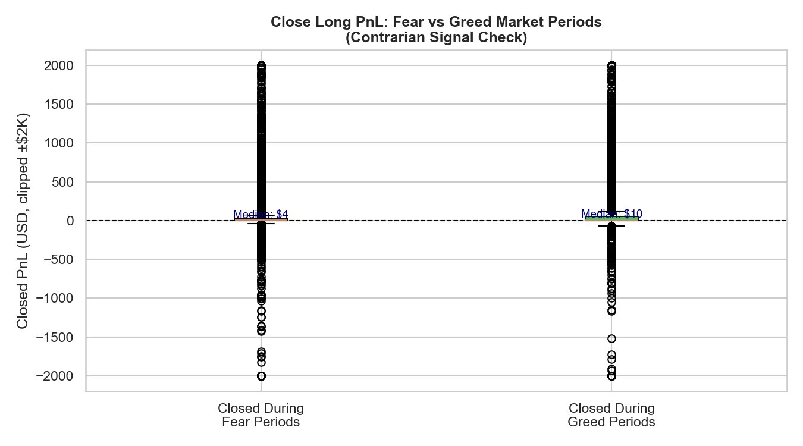

---

### 14. Fee Drag by Sentiment

Fear has the highest avg fee/trade ($1.23) vs Neutral ($0.97) and Greed ($1.06). When measured as % of absolute PnL, **Neutral is the most fee-punishing regime (3.1%)** because raw PnL is lowest there. Greed offers the best fee efficiency at ~2.1%.

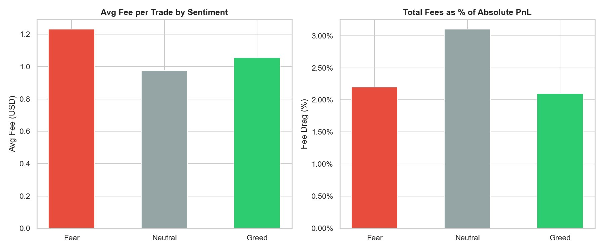

> **Implication:** Neutral market conditions are the worst risk-adjusted environment — highest fee drag per unit of return. Reduce trade frequency in sideways markets.

---

### 15. Account × Sentiment Heatmap

Two clear clusters emerge:

**Event-driven / concentrated bets**: `0x420a...4641` ($6,079 avg PnL in Fear), `0x3f9a...6cf6` ($8,019 in Neutral) — massive single-trade outliers driving averages.

**Consistent all-weather performers**: `0xb123...ed23`, `0x4acb...b9f4`, `0x8381...3b7f` — positive across all three sentiments with reliable per-trade returns.

**Greed-only accounts** (bottom rows): `0xbd5f...b5c3`, `0x8170...a63b`, `0x271b...22ab` — negative PnL in Greed, suggesting these accounts enter too late.

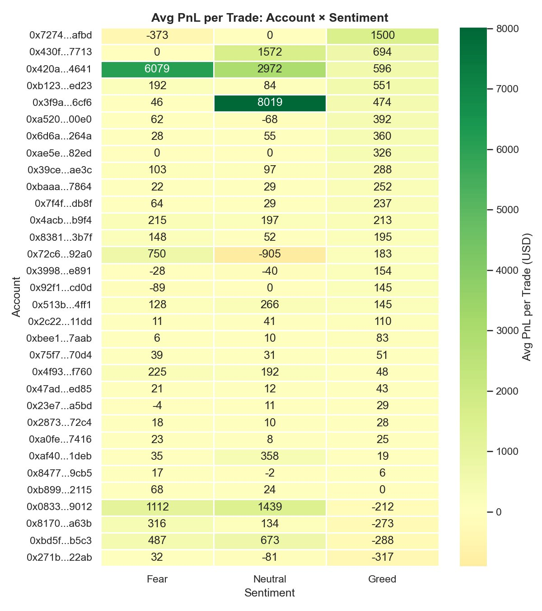

---

## Key Takeaways

| # | Finding |
|---|---|
| 1 | **Smart money captures 75% of profits** — a handful of accounts dominate ($6.1M vs $2.0M for rest) |
| 2 | **These traders are contrarian** — net-long in Fear (1.26x), net-short in Greed (0.85x) |
| 3 | **Fear = larger positions** — avg trade size $6,811 in Fear vs $4,777 in Greed |
| 4 | **SOL and ETH are the best Fear trades** — $1,008 and $488 avg PnL/trade respectively in Fear |
| 5 | **Meme coins are Greed-only** — 80–85% of FARTCOIN/WLD/kPEPE trades in Greed; trading in Fear destroys value |
| 6 | **TRUMP is a Greed trap** — avg loss of $748/trade when entered during Greed periods |
| 7 | **Neutral is the worst fee environment** — 3.1% fee drag vs 2.1% in Greed; reduce frequency in sideways markets |
| 8 | **Win rates are high across all regimes (82–87%)** — the real edge is position sizing and coin selection, not timing |

---

## Tech Stack

Python · pandas · numpy · matplotlib · seaborn · scipy
